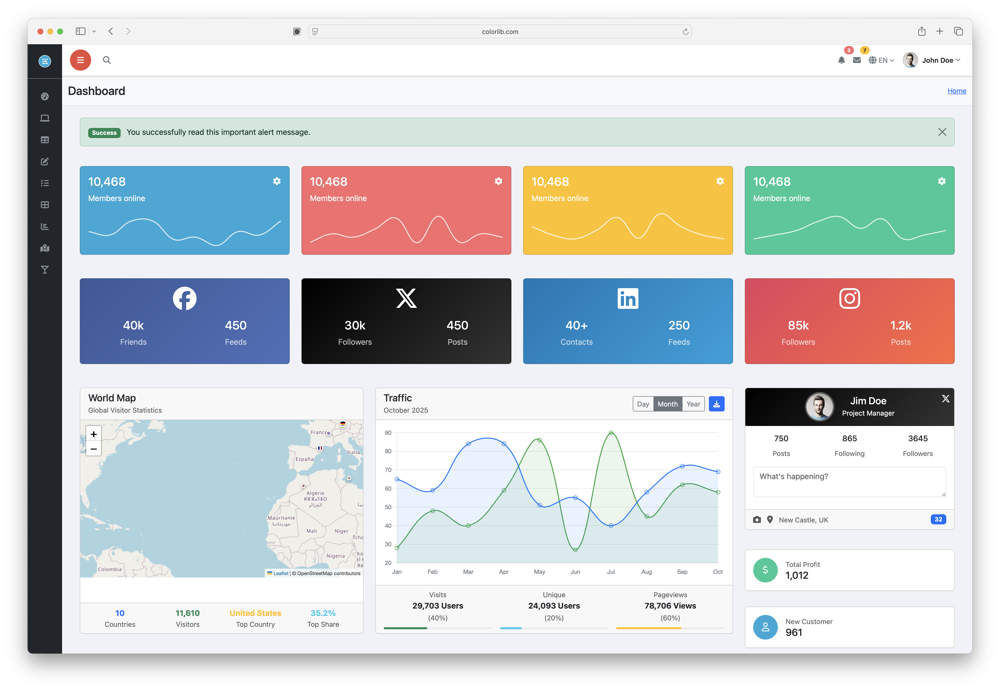

# Sufee HTML5 Admin Dashboard Template v2.0

[](https://colorlib.com/polygon/sufee/index.html)

**Sufee** is a responsive Bootstrap 5 Admin Dashboard Template. Originally built with Bootstrap 4, this major release brings a complete modernization with Bootstrap 5, Vite build system, and a component-based architecture.

[View Live Demo →](https://colorlib.com/polygon/sufee/index.html)

## What's New in v2.0

### Major Changes
- **Bootstrap 5 Migration**: Complete upgrade from Bootstrap 4 to Bootstrap 5
- **Modern Build System**: Replaced Grunt/Bower with Vite and NPM
- **Component Architecture**: New dynamic partials system for code reusability
- **ES6 Modules**: Modern JavaScript with proper module imports
- **Performance**: Optimized build process with code splitting and tree shaking
- **Developer Experience**: Hot Module Replacement (HMR) for instant updates

### Key Features
- Responsive design that works on all devices
- Dynamic sidebar with collapsible navigation
- Reusable components through partials system
- Modern charting with Chart.js
- Data tables with sorting and searching
- Form validation and advanced inputs
- Multiple dashboard layouts
- Authentication pages (login, register, forgot password)
- 100+ UI components and widgets

## Getting Started

### Requirements
- Node.js 14.x or higher
- NPM or Yarn package manager

### Installation

1. **Clone the repository**
   ```bash
   git clone https://github.com/your-repo/sufee-admin-dashboard.git
   cd sufee-admin-dashboard
   ```

2. **Install dependencies**
   ```bash
   npm install
   ```

3. **Start development server**
   ```bash
   npm run dev
   ```
   The development server will start at `http://localhost:3001`

4. **Build for production**
   ```bash
   npm run build
   ```
   Production files will be generated in the `dist/` directory

## Project Structure

```
sufee-admin-dashboard/
├── src/                    # Source files
│   ├── partials/          # Reusable HTML components
│   │   ├── head-common.html
│   │   ├── header.html
│   │   ├── sidebar.html
│   │   └── scripts-common.html
│   ├── scripts/           # JavaScript modules
│   │   ├── app.js         # Main application class
│   │   ├── components/    # UI components
│   │   └── utils/         # Utility functions
│   ├── styles/            # SCSS stylesheets
│   │   ├── main.scss      # Main stylesheet
│   │   ├── variables.scss # Theme variables
│   │   └── components/    # Component styles
│   ├── *.html             # Page templates
│   └── main.js            # JavaScript entry point
├── public/                # Static assets
│   ├── favicon.ico
│   └── images/           # Image assets
├── dist/                  # Production build (generated)
├── package.json           # NPM dependencies
└── vite.config.js         # Vite configuration
```

## Creating Pages

### Basic Page Template

Create a new HTML file in the `src/` directory:

```html
<!DOCTYPE html>
<html lang="en" data-bs-theme="light">
<head>
    <meta charset="utf-8">
    <title>Your Page - Sufee Admin</title>
    <meta name="description" content="Page description">
    <meta name="viewport" content="width=device-width, initial-scale=1">
    <div data-partial="head-common"></div>
</head>

<body class="sufee-dashboard" data-page="your-page-id">
    <div class="d-flex min-vh-100">
        <!-- Sidebar -->
        <div data-partial="sidebar" data-partial-replace="true"></div>

        <!-- Main Content -->
        <div class="main-content flex-grow-1">
            <!-- Header -->
            <div data-partial="header" data-partial-replace="true"></div>

            <!-- Breadcrumb -->
            <div data-breadcrumb 
                 data-breadcrumb-title="Page Title" 
                 data-breadcrumb-path="Section|Subsection|Page Title">
            </div>

            <!-- Content -->
            <section class="content-area p-4">
                <div class="container-fluid">
                    <!-- Your content here -->
                </div>
            </section>
        </div>
    </div>

    <script type="module" src="/main.js"></script>
</body>
</html>
```

### Adding to Navigation

To add your page to the sidebar navigation, edit `src/partials/sidebar.html`:

```html
<li class="nav-item">
    <a class="nav-link" href="your-page.html" data-page="your-page-id">
        <i class="fas fa-icon"></i>
        <span class="nav-text ms-2">Your Page</span>
    </a>
</li>
```

## Partials System

The partials system automatically loads common components:

| Partial | Description |
|---------|-------------|
| `head-common` | Meta tags, CSS imports, favicon |
| `sidebar` | Navigation sidebar with menu |
| `header` | Top header with search and user menu |
| `scripts-common` | Common JavaScript imports |

### Partial Attributes

- `data-partial="name"` - Specifies which partial to load
- `data-partial-replace="true"` - Replaces the container element
- `data-page="id"` - Sets active navigation item
- `data-breadcrumb` - Enables breadcrumb generation

## Components

### Charts
```javascript
// Chart.js is automatically available
const ctx = document.getElementById('myChart').getContext('2d');
const chart = new Chart(ctx, {
    type: 'line',
    data: { /* ... */ }
});
```

### Data Tables
```html
<table class="table table-striped" data-table>
    <!-- Table content -->
</table>
```

### Forms
```html
<form data-validate>
    <!-- Form fields with validation -->
</form>
```

## Customization

### Theme Variables

Edit `src/styles/variables.scss` to customize colors and sizing:

```scss
:root {
  --sidebar-width: 280px;
  --sidebar-collapsed-width: 70px;
  --sidebar-bg: #272c33;
  --sidebar-text: #c8c9ce;
  --sidebar-text-active: #ffffff;
  // Add your custom variables
}
```

### Adding Components

1. Create component file in `src/scripts/components/`
2. Import in relevant pages or main.js
3. Add styles in `src/styles/components/`

## Build Configuration

The project uses Vite for building. Configuration is in `vite.config.js`:

- Development server runs on port 3001
- SCSS is compiled with modern-compiler API
- Source maps enabled for debugging
- Legacy browser support available via plugin

## Browser Support

- Chrome (last 2 versions)
- Firefox (last 2 versions)
- Safari (last 2 versions)
- Edge (last 2 versions)
- No Internet Explorer support

## Available Scripts

| Command | Description |
|---------|-------------|
| `npm run dev` | Start development server with HMR |
| `npm run build` | Build for production |
| `npm run preview` | Preview production build |
| `npm run lint` | Run linter (when configured) |

## Dependencies

### Core
- Bootstrap 5.3.x
- Vite 5.x
- Sass

### UI Libraries
- Chart.js 4.x
- DataTables 1.13.x
- Font Awesome 6.x
- Themify Icons
- Flag Icons

### Utilities
- NO jQuery - 100% vanilla JavaScript
- Native HTML5 form validation
- Modern ES6+ JavaScript modules
- Various chart libraries (Chart.js, etc.)

## Migration from v1.x

If upgrading from version 1.x:

1. **Bootstrap Classes**: Update Bootstrap 4 classes to Bootstrap 5
   - `.badge-*` → `.bg-*`
   - `.font-weight-*` → `.fw-*`
   - `.text-left/right` → `.text-start/end`
   - Data attributes: `data-toggle` → `data-bs-toggle`

2. **jQuery**: Completely removed in v2.0. All code now uses vanilla JavaScript

3. **Build Process**: Grunt tasks are replaced with NPM scripts

4. **File Structure**: Move custom code to src/ directory

## Contributing

1. Fork the repository
2. Create your feature branch (`git checkout -b feature/amazing-feature`)
3. Commit your changes (`git commit -m 'Add amazing feature'`)
4. Push to the branch (`git push origin feature/amazing-feature`)
5. Open a Pull Request

## License

Sufee is licensed under The MIT License (MIT). You can use, copy, modify, merge, publish, distribute, sublicense, and/or sell copies of the final products. But you always need to state that Colorlib is the original author of this template.

## Credits

- Original template by [Colorlib](https://colorlib.com)
- Bootstrap 5 migration and modernization by contributors
- Icons by Font Awesome, Themify, and Flag Icons
- Charts powered by Chart.js and various libraries