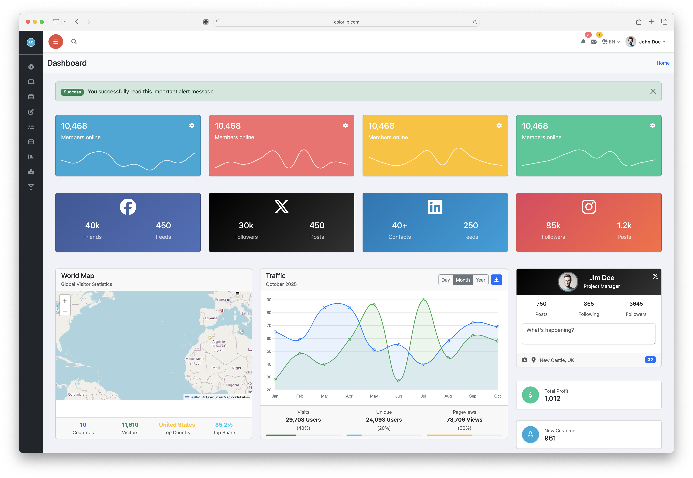
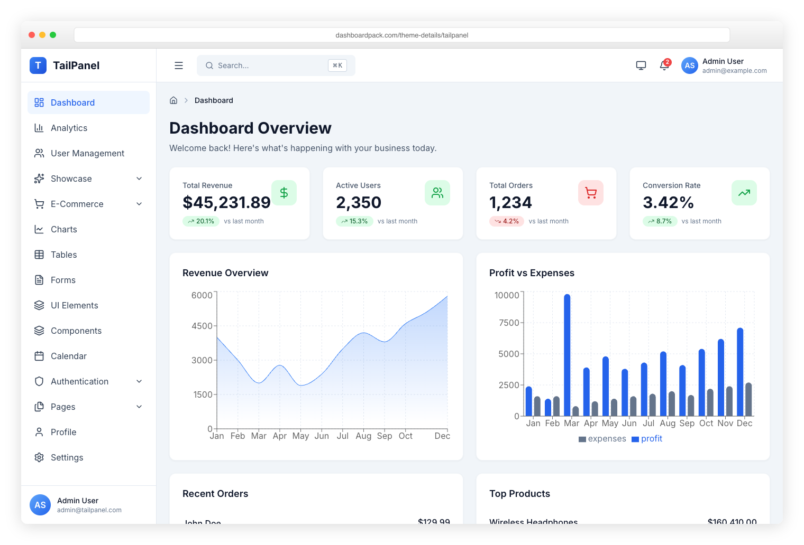
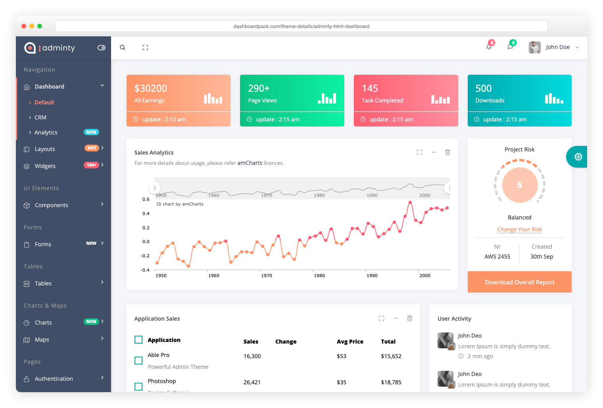
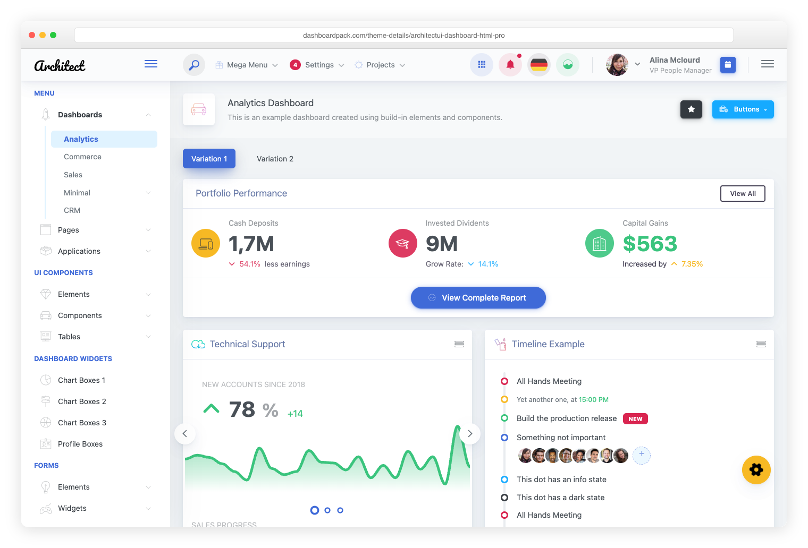
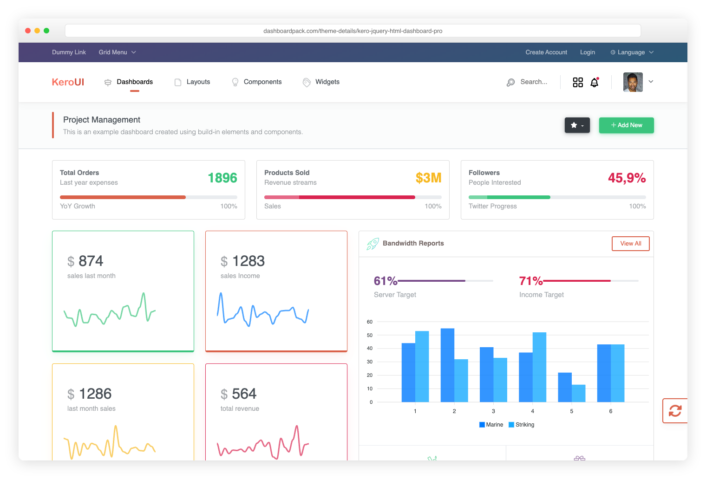
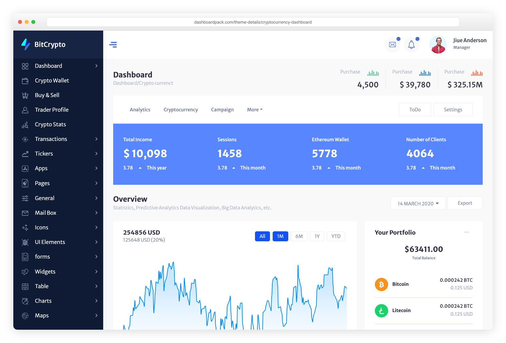

# Sufee HTML5 Admin Dashboard Template v3.0

[](https://preview.colorlib.com/theme/sufee/)

**Sufee** is a responsive Bootstrap 5.3 admin dashboard template with a real design system: layered
design tokens, a working dark mode, and build-time partials so you can compose dashboards without
copy-paste. v3.0 modernizes the visual language and strips ~1,800 lines of legacy code.

[View Live Demo →](https://preview.colorlib.com/theme/sufee/)

## What's New in v3.0

### Design system

- **Design tokens** for radius, shadow, transition, and focus ring — change a value in
  `variables.scss` and it updates everywhere. No more magic numbers.
- **Single CSS variable namespace.** Removed the parallel `--sufee-*` / `--color-flat-*` /
  `--menu-*` declarations; theme colors come from Bootstrap's `--bs-*` (driven by SCSS `$primary`
  etc.). Layout uses `--sidebar-*`, `--content-bg`, `--text-*`.
- **Modernized cards** — rounded corners, subtle shadow with hover lift, no hard border. Dark mode
  adds a thin border for elevation since shadows fade on dark surfaces.
- **Dark mode that works.** Header toggle flips `data-bs-theme`, persists in `localStorage`, follows
  `prefers-color-scheme` by default. Layered slate palette (slate-900 body / slate-800 cards /
  slate-700 hover) with black-tinted shadows that actually read on dark backgrounds.

### Architecture

- **Build-time Handlebars partials** — drop a file in `src/components/` and call it with
  `{{> stat-card color="primary" value="10,468" ...}}`. Inlined at build, no runtime fetch. Three
  partials ship: `stat-card`, `social-card`, `icon-stat-card`.
- **Component catalog page** at `/components-catalog.html` — every reusable pattern with rendered
  preview, copy-paste markup, and props table.
- **Auth and error page shells.** `<body class="auth-page">` + `.auth-card` / `.auth-hero` /
  `.auth-btn`, etc. — login, register, forget, 404, 500 all share one shell. Going from 1,837 lines
  of duplicated inline CSS to a 303-line shared file.
- **Selector-based component loading.** `App.COMPONENT_REGISTRY` lazy-loads modules when their
  selector exists in the DOM — no central `data-page` switch to maintain.
- **Vite glob-discovered HTML entries.** Drop a `.html` in `src/`, it builds.
- **`data-chart` API** —
  `<canvas data-chart="line" data-labels="..." data-values="..." data-datasets="..." data-colors="...">`
  covers line / bar / pie / doughnut / radar / area / polarArea / horizontal / stacked. Replaces
  ~430 lines of inline Chart.js setup on the demo page.

### Bug fixes

- **Sidebar disappearing after mobile/desktop resize** — inline styles from earlier toggle code
  outranked the desktop CSS. Now class-only toggles with leftover-style cleanup.
- **Brand colors weren't actually applied.** `main.js` was importing the prebuilt Bootstrap CSS
  after the themed SCSS, so `--bs-primary` was Bootstrap's `#0d6efd` instead of the brand `#20a8d8`.
  Removed the duplicate import.
- **Self-hosted fonts were 1.6KB Google 404 HTML pages saved with `.woff2` extensions.** Replaced
  with `@fontsource-variable/open-sans`.
- **Logo broken on auth pages**, `confirm()` for logout replaced with a Bootstrap modal, three
  `setTimeout(100)` race-condition workarounds replaced with a deterministic `await` chain, ~45
  ESLint issues cleaned.

### Removed

- ~1,800 lines of dead/legacy code: `navigation.js`, `search.js`, `dom.js`, the `error-handler.js`
  toast/fetch-interception bloat, BS4 leftovers, unused Vite aliases, `themify-icons` NPM duplicate
  of the public-folder copy, `rel="shortcut icon"`, duplicate Bootstrap CSS import.

### Versions in this release

Bootstrap 5.3.8 · Chart.js 4.5.1 · Font Awesome 7.3.1 · Vite 8.2.0 · ESLint 10.8.0 · Sass 1.102.0 ·
Prettier 3.9.6 · `@fontsource-variable/open-sans` 5.3.0 · `vite-plugin-handlebars` 2.0.3. Zero
vulnerabilities.

See [CHANGELOG.md](./CHANGELOG.md) for the complete release notes including breaking changes and
migration guidance.

---

## Premium Dashboard Templates

Ready to ship faster? These production-grade templates from
[DashboardPack](https://dashboardpack.com/?utm_source=github&utm_medium=readme&utm_campaign=sufee)
come with premium support, regular updates, and everything you need for client projects.

<table>
  <tr>
    <td align="center" width="50%">
      <a href="https://dashboardpack.com/theme-details/tailpanel/?utm_source=github&utm_medium=readme&utm_campaign=sufee">
        
      </a>
      <br>
      <a href="https://dashboardpack.com/theme-details/tailpanel/?utm_source=github&utm_medium=readme&utm_campaign=sufee"><strong>TailPanel</strong></a>
      <br>
      <sub>React + TypeScript + Tailwind CSS + Vite. 9 dashboard layouts, theme toggle built in.</sub>
    </td>
    <td align="center" width="50%">
      <a href="https://dashboardpack.com/theme-details/admindek-html/?utm_source=github&utm_medium=readme&utm_campaign=sufee">
        
      </a>
      <br>
      <a href="https://dashboardpack.com/theme-details/admindek-html/?utm_source=github&utm_medium=readme&utm_campaign=sufee"><strong>Admindek</strong></a>
      <br>
      <sub>Bootstrap 5 + vanilla JS. 100+ components, light/dark modes, RTL, 10 color presets.</sub>
    </td>
  </tr>
  <tr>
    <td align="center" width="50%">
      <a href="https://dashboardpack.com/theme-details/adminty-html-dashboard/?utm_source=github&utm_medium=readme&utm_campaign=sufee">
        
      </a>
      <br>
      <a href="https://dashboardpack.com/theme-details/adminty-html-dashboard/?utm_source=github&utm_medium=readme&utm_campaign=sufee"><strong>Adminty</strong></a>
      <br>
      <sub>Bootstrap 5. 160+ pages with a broad component library for any admin scenario.</sub>
    </td>
    <td align="center" width="50%">
      <a href="https://dashboardpack.com/theme-details/architectui-dashboard-html-pro/?utm_source=github&utm_medium=readme&utm_campaign=sufee">
        
      </a>
      <br>
      <a href="https://dashboardpack.com/theme-details/architectui-dashboard-html-pro/?utm_source=github&utm_medium=readme&utm_campaign=sufee"><strong>ArchitectUI</strong></a>
      <br>
      <sub>Bootstrap 5. 250+ components, scalable modular design, 9 dashboard views.</sub>
    </td>
  </tr>
  <tr>
    <td align="center" width="50%">
      <a href="https://dashboardpack.com/theme-details/kero-jquery-html-dashboard-pro/?utm_source=github&utm_medium=readme&utm_campaign=sufee">
        
      </a>
      <br>
      <a href="https://dashboardpack.com/theme-details/kero-jquery-html-dashboard-pro/?utm_source=github&utm_medium=readme&utm_campaign=sufee"><strong>Kero</strong></a>
      <br>
      <sub>Bootstrap 5 + Webpack. Switch between horizontal and sidebar layouts, SASS theming.</sub>
    </td>
    <td align="center" width="50%">
      <a href="https://dashboardpack.com/theme-details/cryptocurrency-dashboard/?utm_source=github&utm_medium=readme&utm_campaign=sufee">
        
      </a>
      <br>
      <a href="https://dashboardpack.com/theme-details/cryptocurrency-dashboard/?utm_source=github&utm_medium=readme&utm_campaign=sufee"><strong>Cryptocurrency Dashboard</strong></a>
      <br>
      <sub>Bootstrap. Purpose-built for crypto exchanges, ICO platforms, and token management.</sub>
    </td>
  </tr>
</table>

<p align="center">
  <a href="https://dashboardpack.com/?utm_source=github&utm_medium=readme&utm_campaign=sufee"><strong>Browse the Premium Collection</strong></a>
</p>

## Getting Started

### Requirements

- Node.js 14.x or higher
- NPM or Yarn package manager

### Installation

1. **Clone the repository**

   ```bash
   git clone https://github.com/your-repo/sufee-admin-dashboard.git
   cd sufee-admin-dashboard
   ```

2. **Install dependencies**

   ```bash
   npm install
   ```

3. **Start development server**

   ```bash
   npm run dev
   ```

   The development server will start at `http://localhost:3001`

4. **Build for production**
   ```bash
   npm run build
   ```
   Production files will be generated in the `dist/` directory

## Project Structure

```
sufee-admin-dashboard/
├── src/
│   ├── *.html              # Pages (auto-discovered by Vite)
│   ├── components/         # Build-time Handlebars partials (stat-card, etc.)
│   ├── partials/           # Runtime fetch-injected partials (sidebar, header, head)
│   ├── scripts/
│   │   ├── app.js          # App class + COMPONENT_REGISTRY
│   │   ├── partials-loader.js
│   │   ├── components/     # UI component modules (lazy-loaded)
│   │   └── utils/
│   ├── styles/
│   │   ├── main.scss       # Bootstrap import + layout shell + component imports
│   │   ├── variables.scss  # Theme palette ($primary etc.) + layout tokens (--sidebar-*)
│   │   └── components/     # One SCSS file per component (sidebar, header, cards, ...)
│   └── main.js             # Entry point
├── public/                 # Copied verbatim into dist/
├── dist/                   # Production build (generated)
├── vite.config.js
└── package.json
```

## Build a New Dashboard Page

End-to-end recipe — about 10 minutes from blank file to live page.

### 1. Create the HTML file

Drop a file in `src/`. Vite auto-discovers anything matching `src/*.html`, so no config edit is
needed.

```html
<!DOCTYPE html>
<html lang="en" data-bs-theme="light">
  <head>
    <meta charset="utf-8" />
    <title>Sales — Sufee Admin</title>
    <meta name="viewport" content="width=device-width, initial-scale=1" />
    <div data-partial="head-common"></div>
  </head>

  <body class="sufee-dashboard" data-page="sales">
    <div class="d-flex min-vh-100">
      <div data-partial="sidebar" data-partial-replace="true"></div>

      <div class="main-content flex-grow-1">
        <div data-partial="header" data-partial-replace="true"></div>
        <div
          data-breadcrumb
          data-breadcrumb-title="Sales"
          data-breadcrumb-path="Dashboards|Sales"
        ></div>

        <main class="content-area p-4">
          <div class="container-fluid">
            <!-- Your content goes here (next step) -->
          </div>
        </main>
      </div>
    </div>

    <script type="module" src="/main.js"></script>
  </body>
</html>
```

### 2. Compose with partials — no copy-paste

There are two kinds of partials. Don't confuse them:

| Kind                         | Where                   | When                                   | Use for                                                    |
| ---------------------------- | ----------------------- | -------------------------------------- | ---------------------------------------------------------- |
| **Build-time** (Handlebars)  | `src/components/*.html` | Inlined at build (no fetch, SEO-clean) | Repeated UI blocks: cards, widgets, panels                 |
| **Runtime** (fetch + inject) | `src/partials/*.html`   | Fetched on page load                   | Page chrome shared across all pages: head, sidebar, header |

Use a build-time partial like a function call. Inside the `<main>` from step 1:

```html
<div class="row g-4 mb-4">
  {{> stat-card color="primary" value="10,468" label="Members online" chartId="widgetChart1"
  chartValues="65,59,84,84,51,55,40,65,59,84"}} {{> stat-card color="success" value="2,341"
  label="Sales today" chartId="widgetChart2" chartValues="12,19,27,43,52,31,48,12,19,27"}}
</div>

<div class="row g-2">
  {{> icon-stat-card color="success" icon="fa-dollar-sign" label="Total Profit" value="1,012"}} {{>
  icon-stat-card color="primary" icon="fa-user" label="New Customers" value="961"}}
</div>
```

Built-in partials:

| Partial          | Props                                                                                                    |
| ---------------- | -------------------------------------------------------------------------------------------------------- |
| `stat-card`      | `color`, `value`, `label`, `chartId`, `chartValues` (optional, comma-separated numbers)                  |
| `social-card`    | `brand`, `iconClass` _or_ `iconHtml`, `primaryValue`, `primaryLabel`, `secondaryValue`, `secondaryLabel` |
| `icon-stat-card` | `color`, `icon` (Font Awesome class), `label`, `value`                                                   |

Adding a new partial: drop `src/components/your-name.html`, then call
`{{> your-name prop1="x" prop2="y"}}`. Use `{{prop}}` for HTML-escaped output, `{{{prop}}}` for raw
HTML (inline SVG, etc.). See the existing partials for examples.

> Prettier mangles multi-line `{{> partial}}` calls. The `.prettierignore` already excludes
> `src/components/` and `src/index.html`; add new templated pages there too.

### 3. Wire interactive components — declarative, not imperative

Components self-register against CSS selectors. If a page contains the selector, the matching JS
module is lazy-loaded automatically — no JS edit, no central switch statement to update.

| Selector                                            | Component                             |
| --------------------------------------------------- | ------------------------------------- |
| `[data-table]`                                      | DataTable (sort/search/paginate)      |
| `[data-chart]`                                      | ChartManager (Chart.js wrappers)      |
| `form[data-validate]`                               | FormValidator                         |
| `[id^="widgetChart"]`, `#trafficChart`, `#worldMap` | WidgetManager (the dashboard widgets) |

So a sortable table is just:

```html
<table class="table table-striped" data-table>
  <thead>
    <tr>
      <th>Name</th>
      <th>Email</th>
    </tr>
  </thead>
  <tbody>
    <!-- rows -->
  </tbody>
</table>
```

A validated form:

```html
<form data-validate>
  <input name="email" data-rules="required|email" />
</form>
```

Adding a new component: append an entry to `App.COMPONENT_REGISTRY` in
[src/scripts/app.js](src/scripts/app.js).

### 4. Add the page to the sidebar

Edit [src/partials/sidebar.html](src/partials/sidebar.html), add a nav link. The `data-page`
attribute must match the body's `data-page="sales"`:

```html
<li class="nav-item">
  <a class="nav-link" href="sales.html" data-page="sales">
    <i class="fas fa-chart-line"></i>
    <span class="nav-text ms-2">Sales</span>
  </a>
</li>
```

The active-state highlight is automatic.

### 5. Run

```bash
npm run dev      # Vite dev server with HMR
npm run build    # Production output to dist/
```

## Customization

### Rebrand the theme palette

Edit [src/styles/variables.scss](src/styles/variables.scss). The SCSS color tokens drive Bootstrap's
`--bs-*` CSS custom properties — change them in one place and every themed component updates:

```scss
$primary: #20a8d8; // → --bs-primary, .btn-primary, .text-primary, ...
$success: #4dbd74; // → --bs-success, .alert-success, validation icons, ...
$danger: #f86c6b;
$info: #63c2de;
$warning: #ffc107;
```

Reference colors in your own SCSS as `var(--bs-primary)` — never hardcode hex.

### Resize/restyle the layout chrome

Layout tokens are CSS custom properties at the bottom of `variables.scss`:

```scss
:root {
  --sidebar-width: 280px;
  --sidebar-collapsed-width: 70px;
  --sidebar-bg: #272c33;
  --sidebar-text: #c8c9ce;
  --content-bg: #f1f2f7;
  --header-height: 70px;
  // ...etc
}
```

### Add a JS component

1. Create the file in [src/scripts/components/](src/scripts/components/) exporting a class.
2. Append to `App.COMPONENT_REGISTRY` in [src/scripts/app.js](src/scripts/app.js) with a CSS
   selector. The loader probes the DOM and lazy-imports your module when the selector matches.
3. Add styles in [src/styles/components/](src/styles/components/) and `@import` from
   [src/styles/main.scss](src/styles/main.scss).

## Build Configuration

The project uses Vite for building. Configuration is in `vite.config.js`:

- Development server runs on port 3001
- SCSS is compiled with modern-compiler API
- Source maps enabled for debugging
- Legacy browser support available via plugin

## Browser Support

- Chrome (last 2 versions)
- Firefox (last 2 versions)
- Safari (last 2 versions)
- Edge (last 2 versions)
- No Internet Explorer support

## Available Scripts

| Command               | Description                       |
| --------------------- | --------------------------------- |
| `npm run dev`         | Start development server with HMR |
| `npm run build`       | Build for production              |
| `npm run preview`     | Preview production build          |
| `npm run lint`        | Lint and auto-fix JavaScript code |
| `npm run format`      | Format all files with Prettier    |
| `npm run quality:fix` | Run both linting and formatting   |

## Dependencies

Exact ranges live in [package.json](./package.json); the versions below are what this release was
built and tested against.

### Runtime

| Package                          | Version | Purpose                                  |
| -------------------------------- | ------- | ---------------------------------------- |
| `bootstrap`                      | 5.3.8   | UI framework (compiled from SCSS source) |
| `chart.js`                       | 4.5.1   | All charts                               |
| `@fortawesome/fontawesome-free`  | 7.3.1   | Icon set                                 |
| `leaflet`                        | 1.9.4   | Vector / world maps                      |
| `flag-icons`                     | 7.5.0   | Country flags                            |
| `@fontsource-variable/open-sans` | 5.3.0   | Self-hosted variable font                |

### Build & tooling

| Package                   | Version | Purpose                             |
| ------------------------- | ------- | ----------------------------------- |
| `vite`                    | 8.2.0   | Dev server and production bundler   |
| `sass`                    | 1.102.0 | SCSS compilation                    |
| `@vitejs/plugin-legacy`   | 8.2.2   | Legacy browser bundle               |
| `vite-plugin-handlebars`  | 2.0.3   | Build-time partials                 |
| `vite-plugin-static-copy` | 4.1.1   | Copies `src/partials/` into `dist/` |
| `eslint`                  | 10.8.0  | Linting                             |
| `prettier`                | 3.9.6   | Formatting                          |

### Not npm dependencies

- **Themify Icons** — served as a static copy from `public/themify-icons/`.
- **DataTables** — not used. `src/scripts/components/datatable.js` is a custom vanilla-JS
  sort/search/paginate component with no third-party dependency.
- **Google Maps** — loaded from a `<script>` tag in `maps-gmap.html`, not bundled.

### Utilities

- NO jQuery - 100% vanilla JavaScript
- Native HTML5 form validation
- Modern ES6+ JavaScript modules

## Migration from v1.x

If upgrading from version 1.x:

1. **Bootstrap Classes**: Update Bootstrap 4 classes to Bootstrap 5
   - `.badge-*` → `.bg-*`
   - `.font-weight-*` → `.fw-*`
   - `.text-left/right` → `.text-start/end`
   - Data attributes: `data-toggle` → `data-bs-toggle`

2. **jQuery**: Completely removed in v2.0. All code now uses vanilla JavaScript

3. **Build Process**: Grunt tasks are replaced with NPM scripts

4. **File Structure**: Move custom code to src/ directory

## Contributing

1. Fork the repository
2. Create your feature branch (`git checkout -b feature/amazing-feature`)
3. Commit your changes (`git commit -m 'Add amazing feature'`)
4. Push to the branch (`git push origin feature/amazing-feature`)
5. Open a Pull Request

## License

Sufee is licensed under The MIT License (MIT). You can use, copy, modify, merge, publish,
distribute, sublicense, and/or sell copies of the final products. But you always need to state that
Colorlib is the original author of this template.

## Related Resources

### Colorlib Admin Dashboard Articles

- [42 Free Bootstrap Admin Dashboard Templates 2025](https://colorlib.com/wp/free-bootstrap-admin-dashboard-templates/)
- [42 Best Free HTML5 Admin Dashboard Templates 2025](https://colorlib.com/wp/free-html5-admin-dashboard-templates/)
- [39 Best Free & Responsive Admin Templates 2025](https://colorlib.com/wp/free-admin-templates/)
- [42 Best Free Dashboard Templates For Admins 2025](https://colorlib.com/wp/free-dashboard-templates/)

## Credits

- Original template by [Colorlib](https://colorlib.com)
- Bootstrap 5 migration and modernization by contributors
- Icons by Font Awesome, Themify, and Flag Icons
- Charts powered by Chart.js and various libraries
